# VisDrone Object Detection – YOLO26 & RF-DETR

A practical implementation of object detection on **VisDrone** (drone-captured traffic and pedestrian scenes) using two models: an efficient **CNN baseline (YOLO26)** and an advanced **transformer-based detector (RF-DETR)**. This project covers the complete pipeline from data preparation and training to evaluation and deployment, including an inference API with a web UI. This documentation guides through the entire process and contains all the steps taken to develop and evaluate both models.

## Contents

- [Technical Architecture](#technical-architecture)
- [Problem & Dataset](#problem--dataset-choice)
- [Data Understanding & Preparation](#data-understanding--preparation)
- [Model Selection & Training](#model-selection--training)
- [Evaluation & Error Analysis](#evaluation--error-analysis)
- [Model Performance & Test Results](#model-performance--test-results-visdrone2019-det-test-dev)
- [Inference & Deployment](#inference--deployment)
- [File Structure](#file-structure)
- [Quick Start](#quick-start)
- [Summary](#summary)

---

## Technical Architecture

The project employs two detector families: a **CNN-based** single-stage detector (YOLO26) as an efficient baseline and a **transformer-based** detector (RF-DETR) as an advanced model.

### Model Structure Overview

#### YOLO26 (CNN)
- **Architecture Type**: CNN (Convolutional Neural Network), single-stage detector
- **Role**: Efficient baseline — fast to train and run, good accuracy–compute tradeoff
- **Design**: Convolutional backbone, neck, and detection head; predicts bounding boxes and class scores in one forward pass
- **Input**: Images resized to fixed size (e.g. 640×640); normalization applied in the pipeline
- **Training**: Pretrained on COCO; fine-tuned on VisDrone; hyperparameters set in the training script and tunable via CLI
- **Output**: Bounding boxes (xyxy or xywh), class IDs, and confidence scores for the 10 VisDrone classes

#### RF-DETR (Transformer)
- **Architecture Type**: Transformer-based (DETR-style with refinements)
- **Role**: Advanced model — higher potential accuracy; more compute than the CNN baseline
- **Design**: Encoder–decoder transformer; encoder processes image features; decoder attends to object queries and produces box and class predictions; no hand-designed NMS; end-to-end set prediction
- **Input**: COCO-format annotations and images; preprocessing and augmentation as provided by the library
- **Training**: Pretrained weights; fine-tuned on VisDrone (COCO format); configurable epochs, batch size, and learning rate
- **Output**: Bounding boxes and class scores (COCO-style); mapped to the same 10 VisDrone classes for evaluation and inference

*We could have pushed RF-DETR for higher accuracy with more training and tuning, but due to time constraints we couldn’t go further—so treat the reported RF-DETR results as a solid baseline with room to improve.*

**Transfer Learning**: Both models use pretrained weights and are fine-tuned on VisDrone. This approach is justified by limited data and compute; training from scratch would be slower and less effective.

---

## Problem & Dataset Choice

**Task:** Object detection — predict bounding boxes and class labels for each object in an image.

**Dataset: VisDrone**
- **Description**: Public benchmark of images and videos from drone viewpoints (traffic, pedestrians, vehicles)
- **Rationale**: Non-trivial (10 classes, small and distant objects, real-world clutter); widely used for detection; suitable for limited-compute training
- **Label Format**: YOLO format (normalized `class_id x_center y_center width height` per line). Conversion to COCO format is used for RF-DETR where required
- **Classes (10)**: pedestrian, people, bicycle, car, van, truck, tricycle, awning-tricycle, bus, motor

---

## Data Understanding & Preparation

### About the Dataset

The **VisDrone2019-DET** dataset is collected by the AISKYEYE team at the Lab of Machine Learning and Data Mining, **Tianjin University, China**. It is one of the largest and most challenging benchmarks for drone-view object detection. Images and video are captured by various drone-mounted cameras, covering a wide range of aspects including location, environment, object types, and density.

### Dataset Statistics

| Statistic | Value |
|-----------|-------|
| **Total static images** | **10,209** |
| **Total video clips** | **288** (261,908 frames) |
| **Total bounding box annotations** | **2,600,000+** |
| **Number of classes** | **10** |
| **Capture locations** | **14 cities** across China (separated by thousands of km) |
| **Download size** | **~2.3 GB** (DET task images only) |

### Split Breakdown

| Split | Images | Purpose |
|-------|--------|---------|
| **VisDrone2019-DET-train** | **6,471** | Model training |
| **VisDrone2019-DET-val** | **548** | Validation during training |
| **VisDrone2019-DET-test-dev** | **1,610** (75,102 instances) | Final evaluation / benchmarking |
| **Total (DET task)** | **8,629** | — |

### Class Distribution

The dataset is **heavily imbalanced** — vehicles (especially cars) dominate while certain classes are underrepresented:

| ID | Class | Approx. % of all annotations | Frequency |
|----|-------|-------------------------------|-----------|
| 0 | **pedestrian** | ~15.4% | ██████████████▌ High |
| 1 | **people** | ~13.5% | █████████████▌ High |
| 2 | **bicycle** | ~2.1% | ██ Low |
| 3 | **car** | ~38.7% | ██████████████████████████████████████▋ Dominant |
| 4 | **van** | ~7.2% | ███████▏ Medium |
| 5 | **truck** | ~3.7% | ███▋ Low–Medium |
| 6 | **tricycle** | ~2.3% | ██▎ Low |
| 7 | **awning-tricycle** | ~1.8% | █▊ Rare |
| 8 | **bus** | ~1.7% | █▋ Rare |
| 9 | **motor** | ~13.6% | █████████████▌ High |

> **Note**: `car` alone accounts for nearly **40%** of all bounding boxes. Rare classes like `awning-tricycle` and `bus` have ≤2% each, making them harder to detect.

### Dataset Coverage

- **Environments**: Urban and rural/country scenes
- **Objects of interest**: Pedestrians, vehicles, bicycles, and tricycles
- **Scene density**: Sparse to very crowded scenes
- **Drone platforms**: Multiple drone models with different cameras
- **Conditions**: Various weather and lighting conditions
- **Attributes**: Scene visibility, object class, and occlusion level are annotated

### Label Format

- **Original**: VisDrone-specific CSV format (`bbox_left, bbox_top, bbox_width, bbox_height, score, class, truncation, occlusion`)
- **YOLO format** (used for YOLO26): Normalized `class_id x_center y_center width height` per line
- **COCO format** (used for RF-DETR): JSON with `images`, `annotations`, and `categories` arrays
- **Conversion**: `scripts/convert_visdrone_to_yolo.py` and `scripts/convert_yolo_to_coco.py` handle format conversion

### Data Validation & Analysis

- **Inspection**:
  - `python scripts/check_dataset.py --data-root <dataset_root>` — validates structure, missing files, invalid labels
  - `python scripts/analyze_data.py --data <dataset_root>` — per-split image and box counts, and class distribution
- **Preprocessing**: Resize and normalization are handled inside the YOLO and RF-DETR training pipelines (e.g. 640px for YOLO, ImageNet-style normalization for RF-DETR)
- **Augmentation**: YOLO uses built-in augmentation (flip, mosaic, mixup, HSV jitter, etc.); RF-DETR uses its library augmentation when available
- **Class Imbalance**: VisDrone is significantly imbalanced (car ~40% vs. awning-tricycle ~2%). The training pipeline mitigates this through focal loss (γ=1.5) and increased mosaic/mixup augmentation to improve exposure to rare classes
- **Noisy Labels**: The check script reports invalid or missing labels; no explicit noise cleaning is applied

**Expected Layout**: Dataset root with `train/images`, `train/labels`, `val/`, `test/`, and a `data.yaml` (path, train/val/test, `nc: 10`, class names).

---

## Model Selection & Training

| Model     | Architecture | Description |
|----------|--------------|-------------|
| **YOLO26** | CNN          | Efficient baseline. Single-stage CNN detector; pretrained on COCO, fine-tuned on VisDrone. |
| **RF-DETR** | Transformer  | Advanced model. Transformer-based (DETR-style) detector; base variant fine-tuned on VisDrone (COCO format). |

**Training (from repo root):**

```bash
# YOLO26: pass path to data.yaml
python scripts/train_yolo26.py --data <path/to/data.yaml> --epochs 50

# RF-DETR: convert YOLO to COCO, then train
python scripts/convert_yolo_to_coco.py --input <yolo_dataset_root> --output <coco_output_root>
python scripts/train_rfdetr.py --dataset-dir <coco_output_root> --output-dir <run_output_dir> --epochs 10
```

Weights are written to the paths or default run directories specified. Hyperparameters (epochs, batch size, lr) are set in the scripts and tunable via CLI.

---

## Evaluation & Error Analysis

- **Data Splits**: Standard VisDrone split — training, validation, and test. The test set is only touched for final evaluation, never during training
- **Metrics**: mAP50, mAP50-95, precision, and recall are reported for YOLO26. RF-DETR uses COCO-style AP metrics (mAP50-95, mAP50, mAP75) along with size-based breakdown (small, medium, large objects)
- **Testing**: Each model can be evaluated independently or together through a unified test pipeline. The pipeline automatically generates metrics JSON, precision-recall curves, confusion matrices, and optionally saves annotated test images with predicted bounding boxes drawn on them
- **Test-Dev Evaluation**: For the official VisDrone2019-DET-test-dev benchmark (1,610 images), a single script handles everything — converts the dataset to the right format, runs both models, and writes all results into a clean folder structure
- **Error Analysis**: Per-class AP, confusion matrices, and failure samples on the validation set are inspected to understand where models struggle and where they perform well

### Where Models Struggle

- **Small / distant objects** — drone imagery has lots of tiny targets that are hard to detect. RF-DETR's small-object mAP (0.051) is ~9× lower than large-object mAP (0.444)
- **Heavy occlusion** — crowded scenes cause missed or partial detections, especially at dense intersections
- **Similar class confusion** — car vs. van, pedestrian vs. people, tricycle vs. awning-tricycle — visually near-identical from drone altitude
- **Scale variation** — a single image can have objects from 10px to 400px, making it hard to optimize for all sizes at once

## Model Performance & Test Results (VisDrone2019-DET-test-dev)

Evaluation is run on **VisDrone2019-DET-test-dev** (1,610 images, 75,102 instances). Both models are tested and results are saved in a standard layout under `test_results_testdev/results/`.

### Commands to Reproduce

```bash
# Full pipeline (convert test-dev → YOLO/COCO, then run both models)
python scripts/run_test_on_testdev.py --testdev-dir . --output-dir test_results_testdev

# Test only (dataset already converted)
python scripts/run_test_on_testdev.py --test-only --output-dir test_results_testdev

# RF-DETR only (YOLO26 results already saved)
python scripts/run_test_on_testdev.py --test-only --rfdetr-only --output-dir test_results_testdev
```

### Output Layout

The evaluation pipeline generates comprehensive analysis outputs that demonstrate the effectiveness of both models. Each of `test_results_testdev/results/yolo26/` and `test_results_testdev/results/rfdetr/` contains:

| Item | Description |
|------|--------------|
| `metrics.json` | mAP50, mAP50-95, precision, recall; COCO-style AP for RF-DETR |
| `plots/` | Precision–recall curves, confusion matrix, validation batch predictions |
| `annotated/` | Test images with predicted bounding boxes drawn |

### Test Set Results (YOLO26)

| Metric | Value |
|--------|--------|
| mAP50 | 0.334 |
| mAP50-95 | 0.191 |
| mAP75 | 0.193 |
| Precision | 0.454 |
| Recall | 0.348 |

Per-class mAP50 (VisDrone 10 classes): car (0.47), bus (0.38), van (0.25), truck (0.24), pedestrian (0.13), motor (0.13), awning-tricycle (0.11), tricycle (0.10), people (0.06), bicycle (0.05).

### Test Set Results (RF-DETR)

| Metric | Value |
|--------|--------|
| mAP50-95 | 0.137 |
| mAP50 | 0.216 |
| mAP75 | 0.148 |
| mAP (small) | 0.051 |
| mAP (medium) | 0.221 |
| mAP (large) | 0.444 |

COCO-style evaluation; metrics and curve-style plots are written to `test_results_testdev/results/rfdetr/` (metrics.json, plots/, annotated/) when the RF-DETR test is run. The pipeline generates these plots automatically.

### Training Results and Visualizations

The following visualizations are stored in the `images/` folder at the repository root.

#### YOLO26 — Confusion Matrix

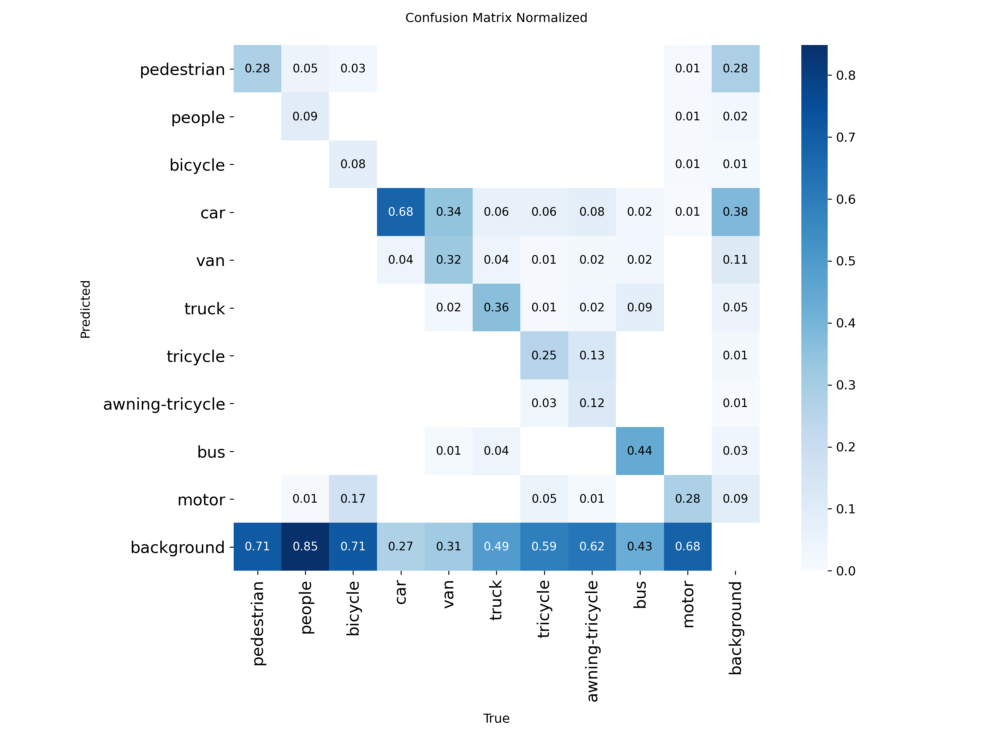
*Normalized confusion matrix showing classification performance across all 10 VisDrone classes*

#### YOLO26 — Precision-Recall Curve

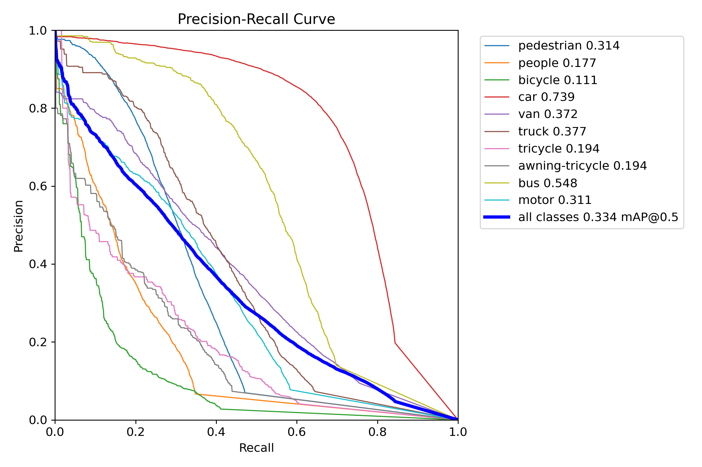
*Precision-Recall curve demonstrating detection quality at various confidence thresholds*

#### YOLO26 — Precision Curve

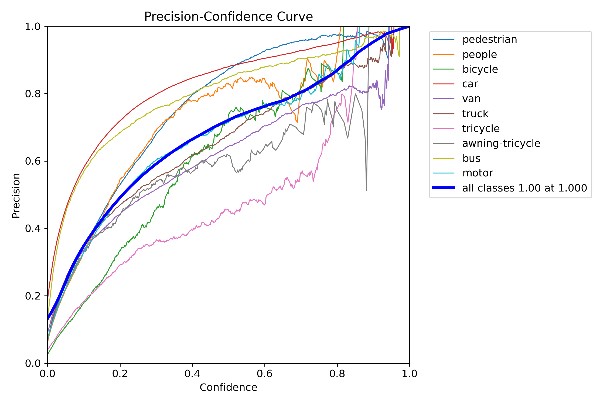
*Precision curve showing model precision across confidence thresholds*

#### YOLO26 — Sample Predictions

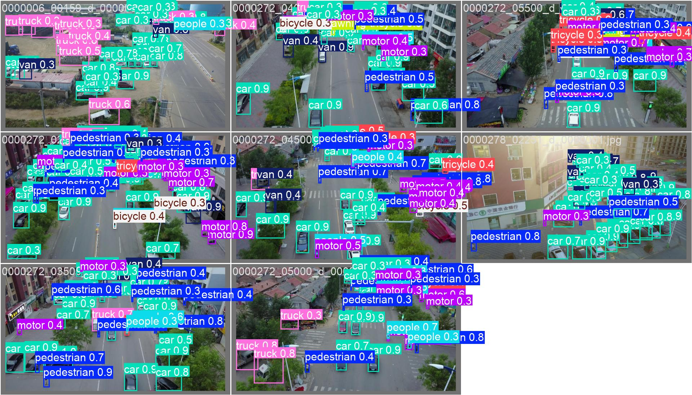
*Sample validation batch predictions showing detected objects with bounding boxes and class labels*

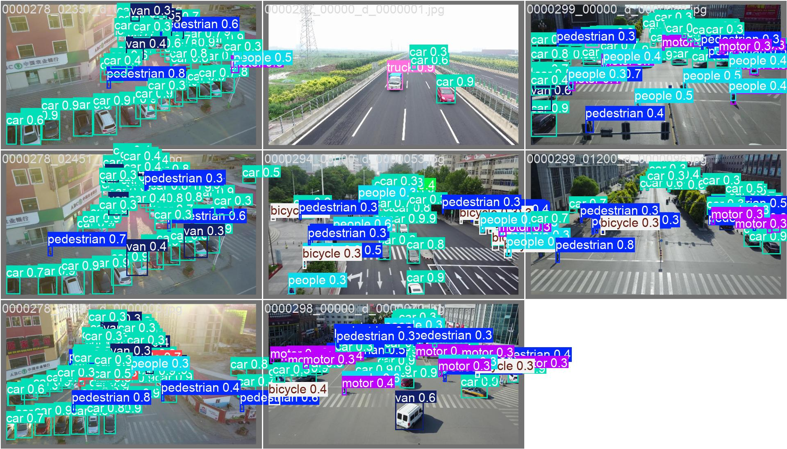
*Additional validation batch predictions demonstrating model performance on drone-captured scenes*

#### RF-DETR — Metrics Summary (Curve)

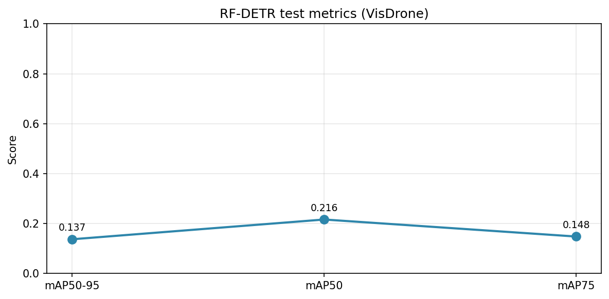
*Main metrics (mAP50-95, mAP50, mAP75) as a curve across thresholds on VisDrone test-dev*

#### RF-DETR — Metrics by Object Scale

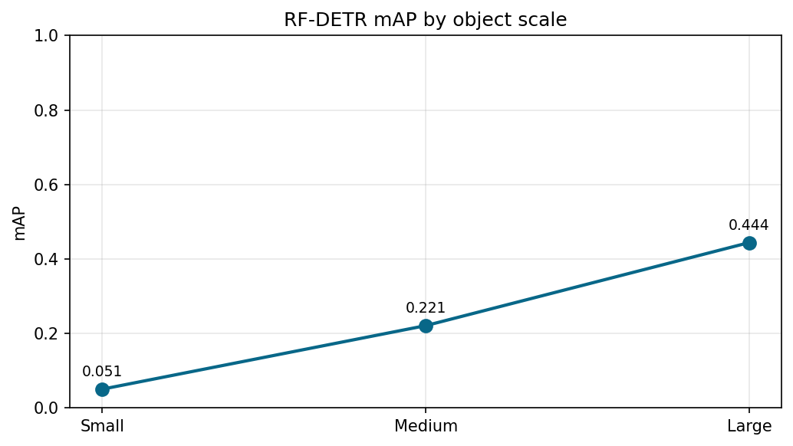
*mAP by object scale (small, medium, large) showing performance across different object sizes*

#### RF-DETR — Metrics Overview (Dual Panel)

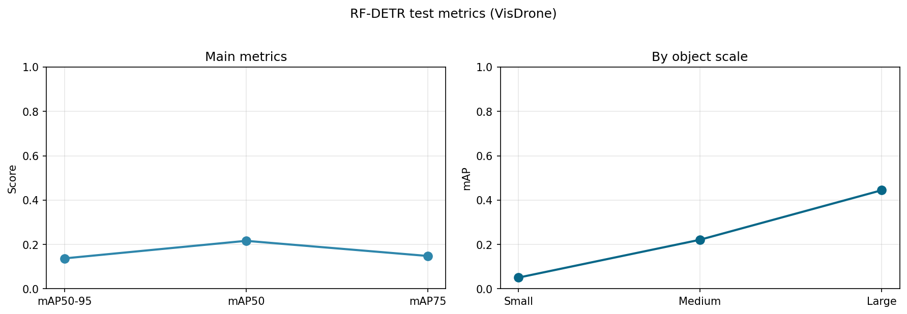
*Combined view: main metrics and scale breakdown in one figure*

#### RF-DETR — Score Distribution

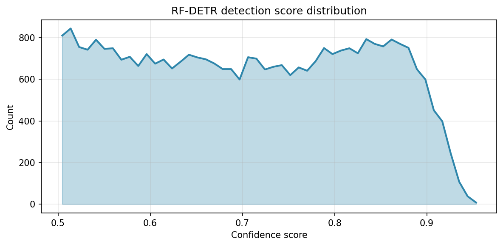
*Confidence score distribution of detections on the test set*

#### RF-DETR — Detections per Class

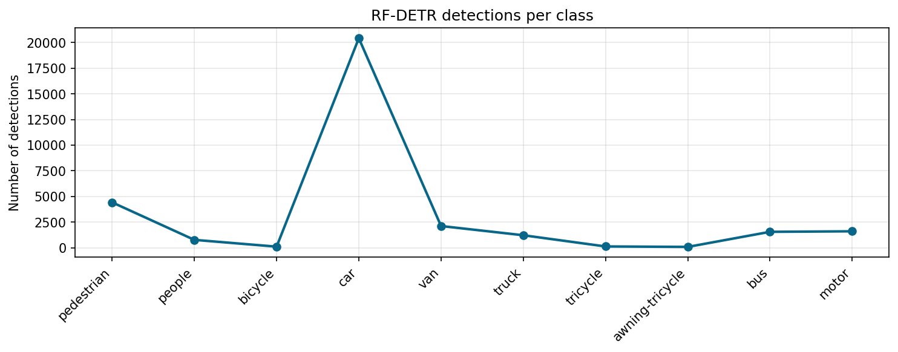
*Number of detections per VisDrone class (pedestrian, people, bicycle, car, van, truck, tricycle, awning-tricycle, bus, motor)*

#### RF-DETR — Sample Predictions (Model Output)

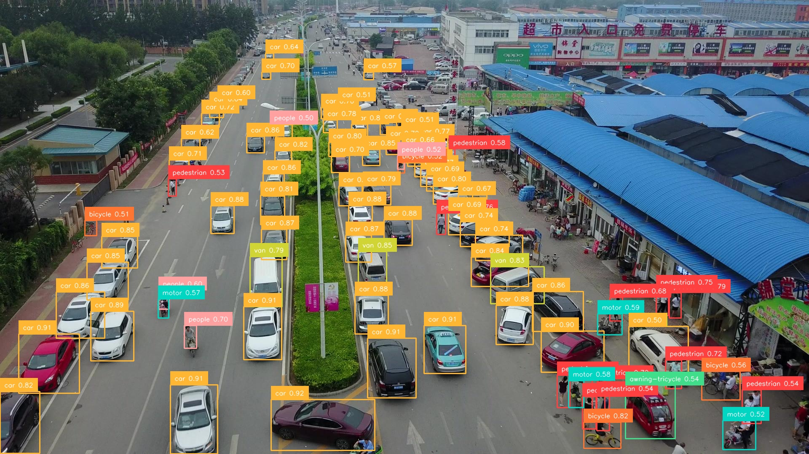
*RF-DETR predictions on a test-dev image: bounding boxes and class labels*

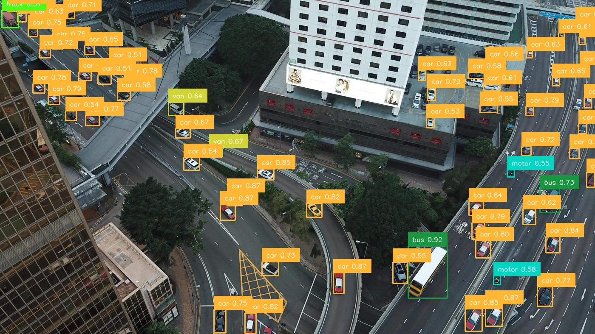
*RF-DETR predictions on a drone-captured scene*

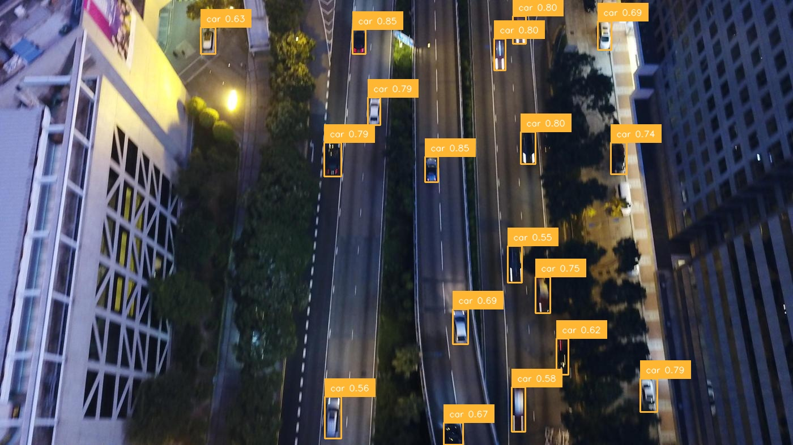
*Additional RF-DETR annotated output on VisDrone test-dev*

Annotated test images (model predictions drawn on test-dev images) are saved in:
- `test_results_testdev/results/yolo26/annotated/`
- `test_results_testdev/results/rfdetr/annotated/`

### Analysis Outputs Explained

The **`images/`** folder at the repository root contains the visualizations shown in this README: YOLO26 (confusion matrix, PR curve, precision curve, sample predictions) and RF-DETR (metrics summary, metrics by scale, metrics overview, score distribution, detections per class, sample annotated outputs). 

- **`yolo26/metrics.json`**: mAP50, mAP50-95, precision, recall, and per-class AP
- **`yolo26/plots/`**: Confusion matrix, PR curves, validation batch predictions (key plots in `images/`)
- **`rfdetr/metrics.json`**: mAP50-95, mAP50, mAP75, mAP by scale (small/medium/large)
- **`rfdetr/plots/`**: Curve-style metrics and score/class plots (key plots in `images/`)
- **`yolo26/annotated/`** and **`rfdetr/annotated/`**: Test images with predicted bounding boxes drawn

These outputs demonstrate the model evaluation process, metric reporting, and visual inspection capabilities for both YOLO26 and RF-DETR on the VisDrone test-dev set.

---

## Inference & Deployment

**CLI:**

```bash
python scripts/inference.py --model yolo26 --image <path/to/image.jpg> [--out <output.jpg>]
python scripts/inference.py --model rfdetr --image <path/to/image.jpg> [--out <output.jpg>]
```

**Inference API with UI:**

- The API allows switching between **YOLO26** and **RF-DETR**; uploading **image or video**; running inference; and receiving **annotated image/video** and detections (for images)
- Run from repo root:

```bash
pip install -r requirements.txt
uvicorn api.main:app --host 0.0.0.0 --port 8000
```

- Open **http://localhost:8000** in a browser: select model, choose file, click "Run inference", then view or download the result
- **API**: `POST /infer` with form fields `model` (yolo26 | rfdetr) and `file` (image or video). Response includes `result_url` (annotated file) and `detections` (for images)

Model loading and paths are configurable; default weights are resolved from the `models/` directory (see `api/engine.py`).

---

## File Structure

Production layout: config and code at top level; data and outputs in dedicated dirs; results follow a single standard layout.

```
VisDrone_YOLO-RF-Detr/
├── api/                               # Inference API and UI
│   ├── main.py                        # FastAPI app
│   ├── engine.py                      # YOLO26 / RF-DETR inference
│   └── static/index.html             # Web UI (upload, run, download)
├── scripts/                           # Pipeline: data, train, test, export
│   ├── convert_visdrone_to_yolo.py   # VisDrone → YOLO
│   ├── convert_yolo_to_coco.py       # YOLO → COCO (for RF-DETR)
│   ├── check_dataset.py              # Dataset validation
│   ├── analyze_data.py               # Class distribution, counts
│   ├── train_yolo26.py               # YOLO26 training
│   ├── train_rfdetr.py               # RF-DETR training
│   ├── test_yolo26.py                 # YOLO26 eval (metrics + plots + optional annotated)
│   ├── test_rfdetr.py                # RF-DETR eval (metrics + results + plots + optional annotated)
│   ├── run_test_suite.py             # Run both models → standard output layout
│   ├── run_test_on_testdev.py        # Full test-dev: convert + run both → standard layout
│   ├── inference.py                  # CLI inference
│   └── error_analysis.py             # Validation analysis
├── models/                            # Weights (gitignored; add best.pt / .pth locally)
│   ├── Yolo26/weights/                # best.pt
│   └── rfdetr/weights/               # checkpoint_best_regular.pth, etc.
├── data/                              # Dataset roots (gitignored; place VisDrone here)
├── images/                            # README assets (curves, sample preds)
├── requirements.txt
├── Dockerfile                         # API + inference
└── README.md
```

**Test output layout** (same for `test_results/`, `test_results_testdev/results/`, or any `--output-dir`):

```
<output-dir>/
├── yolo26/
│   ├── metrics.json                  # mAP50, mAP50-95, precision, recall
│   ├── plots/                        # F1/PR curves, confusion matrix
│   └── annotated/                    # Test images with boxes (if --save-predictions)
└── rfdetr/
    ├── metrics.json                  # mAP50-95, mAP50, mAP75, mAP by scale
    ├── results.json                  # COCO-format detections
    ├── plots/                        # Curve-style metrics and score/class plots
    └── annotated/                    # Test images with boxes (if --save-annotated)
```

Running the test pipeline (e.g. `test_rfdetr.py`, `run_test_suite.py`, or `run_test_on_testdev.py`) produces metrics and plots in one go; no separate plot step.

---

## Quick Start

```bash
# 1. Install
pip install -r requirements.txt

# 2. Data: place VisDrone (YOLO format) in a dataset directory, then:
python scripts/check_dataset.py --data-root <dataset_root>
python scripts/analyze_data.py --data <dataset_root>
# Ensure a data.yaml exists (path, train/val/test, nc: 10, names)

# 3. Train (optional; use provided weights under models/ if available)
python scripts/train_yolo26.py --data <path/to/data.yaml> --epochs 50
python scripts/convert_yolo_to_coco.py --input <yolo_dataset_root> --output <coco_output_root>
python scripts/train_rfdetr.py --dataset-dir <coco_output_root> --output-dir <run_output_dir> --epochs 10

# 4. Test (single model or both in standard layout)
python scripts/test_yolo26.py --data <path/to/data.yaml> --output-dir <output_dir> --save-predictions
python scripts/test_rfdetr.py --dataset-dir <coco_root> --output-dir <output_dir> --save-annotated
# Or run both:
python scripts/run_test_suite.py --data <path/to/data.yaml> --data-coco <coco_root> --output-dir test_results

# 5. Inference API + UI
uvicorn api.main:app --host 0.0.0.0 --port 8000
# Open http://localhost:8000 in a browser
```

---

## Performance Highlights

- **Dual Model Evaluation**: YOLO26 (CNN baseline) and RF-DETR (transformer) evaluated on VisDrone2019-DET-test-dev
- **Standard Result Layout**: Metrics, plots (confusion matrix, PR curves), and annotated test images per model
- **Reproducible Pipeline**: Single script converts test-dev to YOLO/COCO and runs both tests; optional test-only or RF-DETR-only runs
- **Inference API**: Web UI to switch models, upload image/video, and download annotated output

This project represents a complete pipeline for drone-view object detection, from dataset preparation and model training to evaluation and deployment with both CNN and transformer-based detectors.

---

## License & References

- **VisDrone**: [visdrone.net](http://aiskyeye.com/)
- **YOLO**: [Ultralytics](https://github.com/ultralytics/ultralytics)
- **RF-DETR**: [Roboflow RF-DETR](https://github.com/roboflow/rf-detr)

---

## Summary

This repository represents a complete, production-ready implementation of object detection on the VisDrone benchmark using two detector families: an efficient CNN baseline (YOLO26) and an advanced transformer-based model (RF-DETR). The project demonstrates a comprehensive approach from data preparation and model training to evaluation and deployment, including an inference API with a web UI.

**What makes this repository special:**

The system combines two complementary detection paradigms in one pipeline: **YOLO26** (fast, CNN-based, single-stage) and **RF-DETR** (transformer-based, set prediction). This dual-model approach is valuable for comparing efficiency versus accuracy and for deployment flexibility (e.g. lightweight YOLO26 for real-time use, RF-DETR for higher accuracy when compute allows).

**Technical Excellence:**
- **Dual Architecture**: CNN baseline and transformer-based detector with shared evaluation and deployment tooling
- **Complete Pipeline**: Data conversion (VisDrone → YOLO → COCO), training scripts, unified test pipeline (test-dev), and inference API
- **Standard Outputs**: Metrics (JSON), plots (confusion matrix, PR curves), and annotated images in a consistent layout per model
- **Documentation**: Step-by-step guidance from dataset setup to training, testing, and deployment

**Real-World Impact:**

With evaluation on the official VisDrone2019-DET-test-dev set (1,610 images), the pipeline provides reproducible metrics and visualizations for both models. The inference API enables rapid prototyping and demos by switching between YOLO26 and RF-DETR and processing images or videos through a simple web interface.

**Complete Implementation:**

Unlike many projects that focus only on a single model or training step, this repository provides a full pipeline: dataset validation and conversion, training for both YOLO26 and RF-DETR, unified test-dev evaluation with saved metrics and plots, CLI inference, and a FastAPI-based web UI for inference. All paths and commands are documented so that the entire process from raw VisDrone data to deployed inference can be reproduced.

This project serves as a practical example of how to build, train, evaluate, and deploy object detection models on drone-captured imagery, making it useful for researchers, practitioners, and students interested in VisDrone or in comparing CNN and transformer-based detectors.
